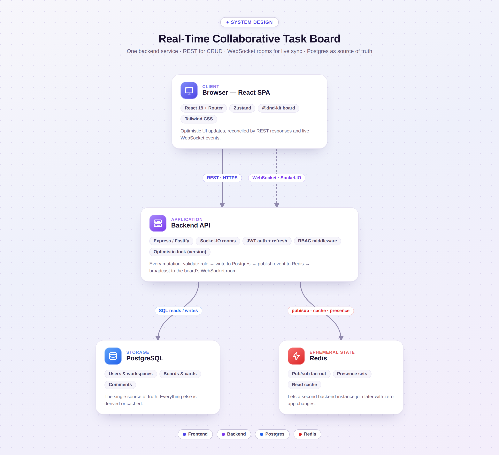

# Architecture

## System overview



<sub>Source: [`assets/architecture-diagram.html`](assets/architecture-diagram.html) (self-contained, open it in a browser to tweak and re-screenshot).</sub>

One backend service, not microservices — the real-time task board doesn't
need service decomposition to be a legitimate "hard" project; the
real-time sync and concurrency handling are hard enough on their own.
Postgres is the only source of truth. Redis holds nothing that can't be
regenerated: cached lookups, the pub/sub channel used to fan real-time
events out to every backend instance, and per-board presence sets.

## Frontend architecture

```
frontend/src/
  lib/client.ts        <- every page/component calls through here
       ├── api.ts        real REST client (axios), used when VITE_USE_MOCKS=false
       └── mockBackend.ts in-memory fake, used by default so the UI works with no backend
  hooks/useSocket.ts   <- same seam for real-time: real Socket.IO room vs. a mock event bus
  store/authStore.ts   <- zustand; holds the logged-in user + drives the JWT in api.ts
  pages/*              <- one component per route, own their local data fetching
  components/board/*   <- the kanban board itself (columns, cards, drag-and-drop, card modal)
  components/ui/*      <- unstyled-framework-free primitives (Button, Modal, Avatar, Input, Badge)
```

**Why the `client.ts` seam exists**: it lets the frontend be built and
demoed before the backend exists, and it means adopting the real backend
later is a one-line env var flip, not a refactor. Every function in
`api.ts` and `mockBackend.ts` has an identical signature — `client.ts`
just picks which implementation to call. No component ever imports `api.ts`
or `mockBackend.ts` directly.

**State**: mostly local component state (`useState` in `BoardPage`, driven
by the initial REST fetch and then kept in sync by WebSocket events) plus
one global store (`authStore`, zustand) for the logged-in user. There's no
global client-side cache/store for boards — a real-time collaborative app
needs its state to reflect "what the server just told me," not a stale
cache, so `BoardPage` owns its board's state directly and mutates it only
in response to REST responses or socket events.

## Backend architecture (what you're building)

```
backend/
  routes/            REST handlers (auth, workspaces, boards, columns, cards, comments, notifications)
  middleware/         auth (verify JWT), rbac (check role for the target workspace)
  sockets/            Socket.IO connection handler: board:join/leave, broadcasts
  db/                 Postgres access (models/queries/migrations)
  redis/               presence set, pub/sub publisher+subscriber, cache-aside helpers
```

A mutation always follows the same shape:

1. REST handler validates the request and the caller's role (RBAC middleware).
2. It writes to Postgres (the only source of truth).
3. It publishes the resulting event to Redis pub/sub on a channel named
   after the board (`board:<id>`).
4. Every backend instance subscribed to that channel re-emits the event to
   its own locally-connected Socket.IO clients in that board's room.

Step 3/4 is what makes this design survive running more than one backend
instance (a real horizontal-scaling story, not just a single-process demo)
— a client connected to instance A gets updates that originated on
instance B. See `backend/README.md` for the exact event payloads.

## Data flow: opening a board

1. `GET /boards/:id` → `{ board, columns, cards }` (REST, one round trip).
2. Client opens a Socket.IO connection (if not already open) and emits
   `board:join { boardId }`.
3. Server adds the socket to room `board:<id>`, adds the user to the
   Redis presence set for that board, and broadcasts `presence:sync` with
   the full current list to the room.
4. From here, all further changes to this board — by this client or any
   other client with the board open — arrive as WebSocket events, not
   polling.

## Data flow: editing a card (optimistic concurrency)

This is the scenario worth being able to draw on a whiteboard:

1. Client A and Client B both have the board open; both show card X at
   `version: 3`.
2. Client A edits the description, sends `PATCH /cards/X { description,
   version: 3 }`. Server checks `version === 3`, applies the change,
   bumps to `version: 4`, responds `200`, broadcasts `card:updated`.
3. Client B, unaware, edits the assignee and sends `PATCH /cards/X
   { assigneeId, version: 3 }` (it still thinks the version is 3 — it
   hasn't received A's broadcast yet, or the user had the modal open
   before A's change landed).
4. Server checks `version === 3` against the *current* row, which is now
   4 → mismatch → `409 Conflict`, no write happens.
5. Client B's UI shows a conflict banner and re-fetches the card, now
   showing A's change at `version: 4`. Client B's user re-applies their
   edit on top of the current state if they still want it.

No lost updates, no silent overwrite, no last-write-wins data loss. This
is a plain optimistic-locking pattern (a `WHERE id = ? AND version = ?`
update), not distributed consensus — cheap to implement, and exactly the
kind of thing an interviewer will ask you to justify.

## Deployment shape (target, not required to build day one)

- Single backend instance + single Postgres + single Redis is a completely
  legitimate finished state for this project.
- The Redis pub/sub layer exists specifically so that adding a second
  backend instance behind a load balancer later requires zero application
  changes — that's the point of routing broadcasts through Redis instead
  of just calling `io.to(room).emit()` directly (which only reaches
  clients connected to *that* process).
