# Diagrams

All diagrams are [Mermaid](https://mermaid.js.org/) — they render natively on
GitHub and live as text in the repo, so they diff and review like code. The
polished overview image is
[`assets/architecture-diagram.png`](assets/architecture-diagram.png)
(source: [`assets/architecture-diagram.html`](assets/architecture-diagram.html)).

Contents: [C4 context](#c4-level-1--system-context) ·
[C4 container](#c4-level-2--containers) ·
[Backend class diagram](#class-diagram-backend) ·
[Frontend structure](#class-diagram-frontend) ·
[ER diagram](#er-diagram) ·
[Sequence: sign-in & refresh](#sequence-sign-in-and-token-refresh) ·
[Sequence: open a board](#sequence-open-a-board-and-presence) ·
[Sequence: edit a card](#sequence-edit-a-card-optimistic-concurrency) ·
[Sequence: multi-instance fan-out](#sequence-move-a-card-multi-instance-fan-out) ·
[Sequence: comment → notification](#sequence-comment-and-notification) ·
[Card version state](#state-machine-card-version-under-concurrent-edits) ·
[Client connection state](#state-machine-client-realtime-connection) ·
[Deployment](#deployment)

---

## C4 level 1 — system context

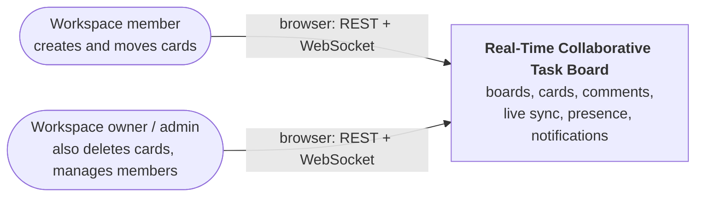

## C4 level 2 — containers

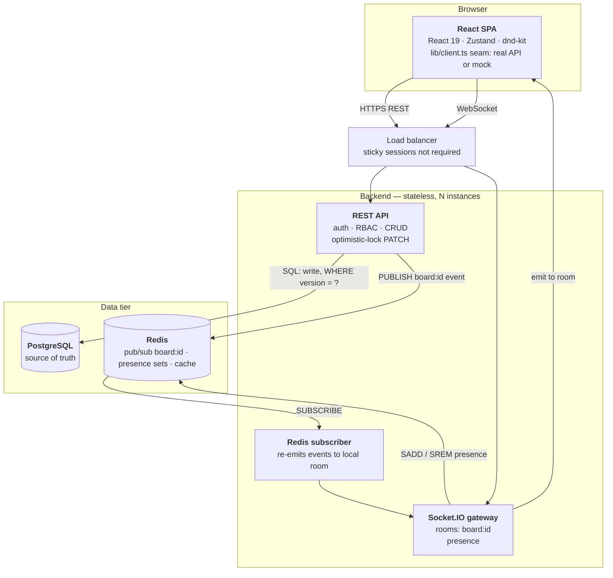

---

## Class diagram (backend)

Layered: **routes → middleware → services → repositories**, with the real-time
layer (publisher / subscriber / gateway) as a sibling that services call
*after* a successful write. Repositories are interfaces in practice (Postgres
adapters), so services can be unit-tested with fakes. Names are
TypeScript-flavoured; the structure is language-agnostic.

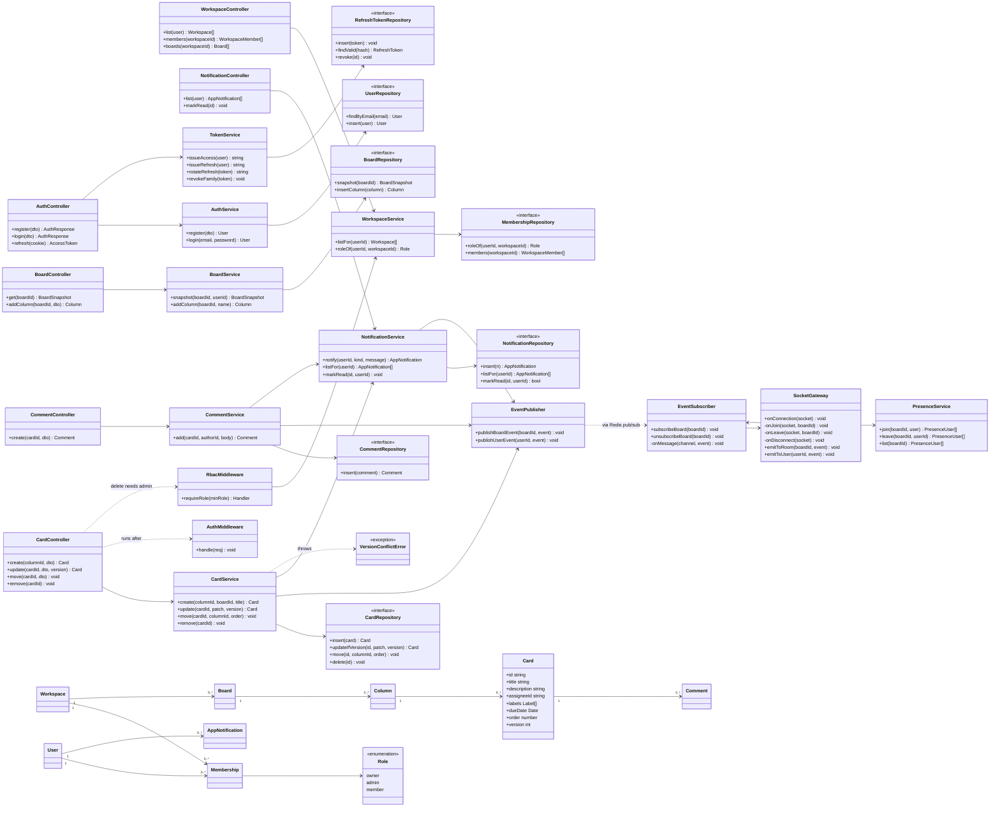

## Class diagram (frontend)

The frontend is already built. The key structural idea is the **`client.ts`
seam**: pages only ever import `client`, which delegates to either the real
REST client or an in-memory mock with identical signatures — so the backend
can be built later with a one-line env flip.

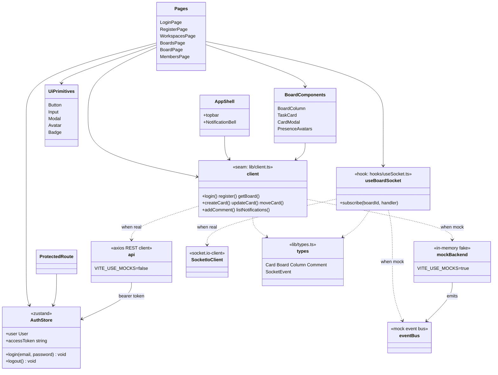

---

## ER diagram

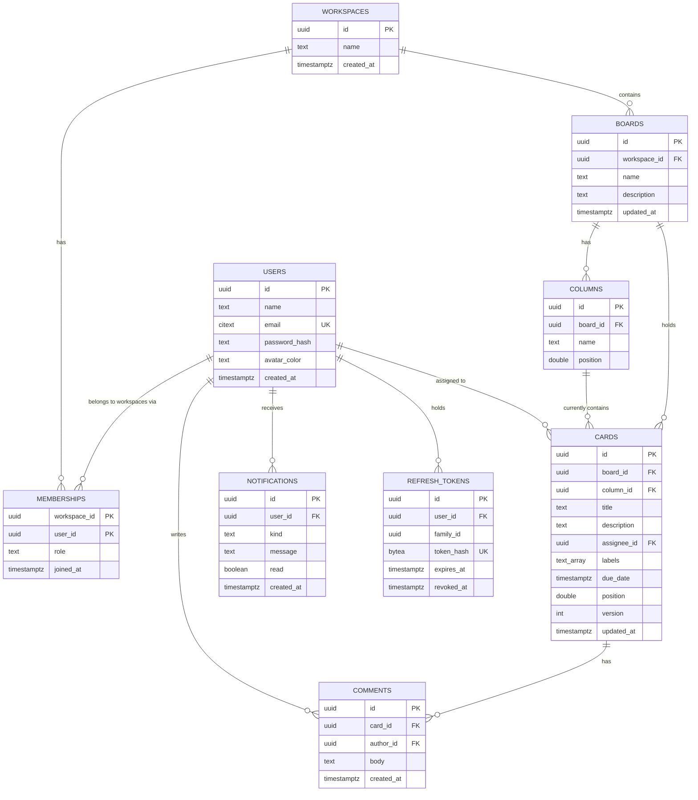

---

## Sequence: sign-in and token refresh

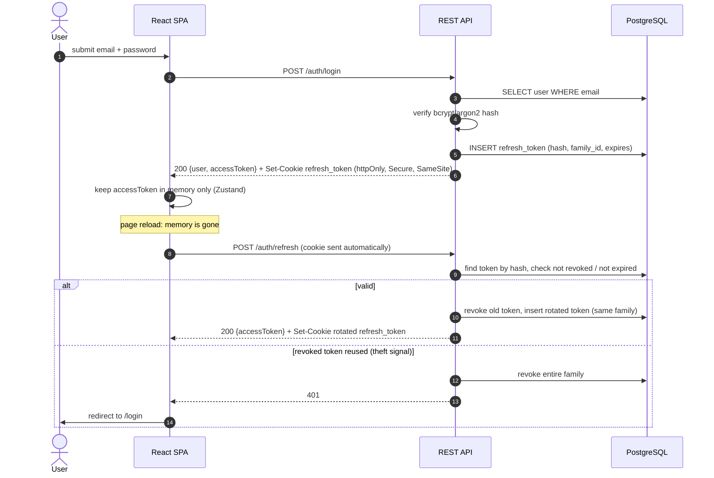

## Sequence: open a board and presence

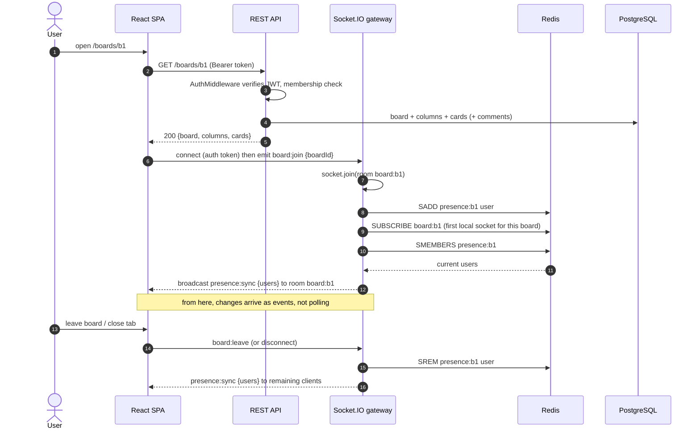

## Sequence: edit a card (optimistic concurrency)

The scenario worth being able to draw on a whiteboard.

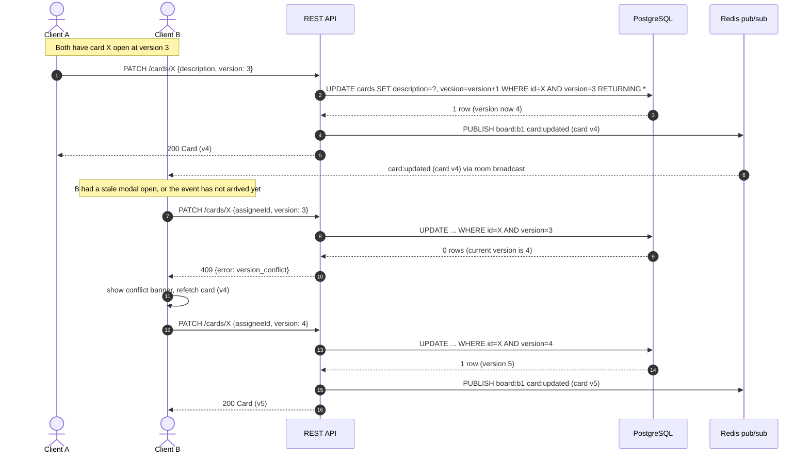

## Sequence: move a card (multi-instance fan-out)

Why broadcasts go through Redis instead of calling `io.to(room).emit()`
directly: a client connected to instance 2 must see a change made through
instance 1.

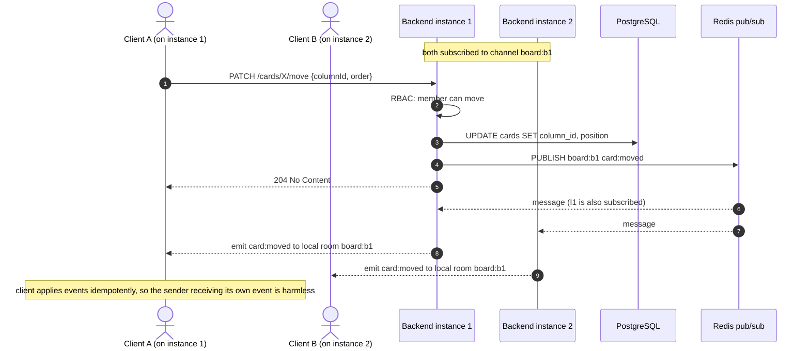

## Sequence: comment and notification

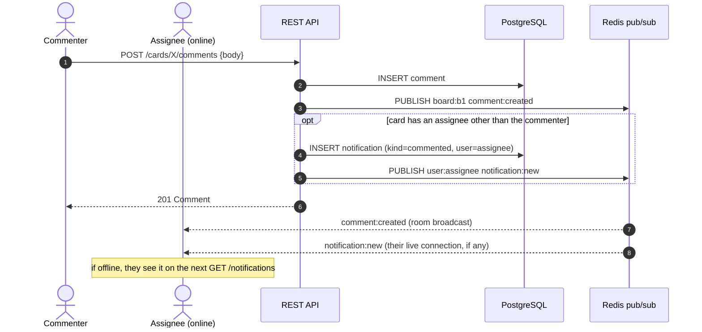

---

## State machine: card version under concurrent edits

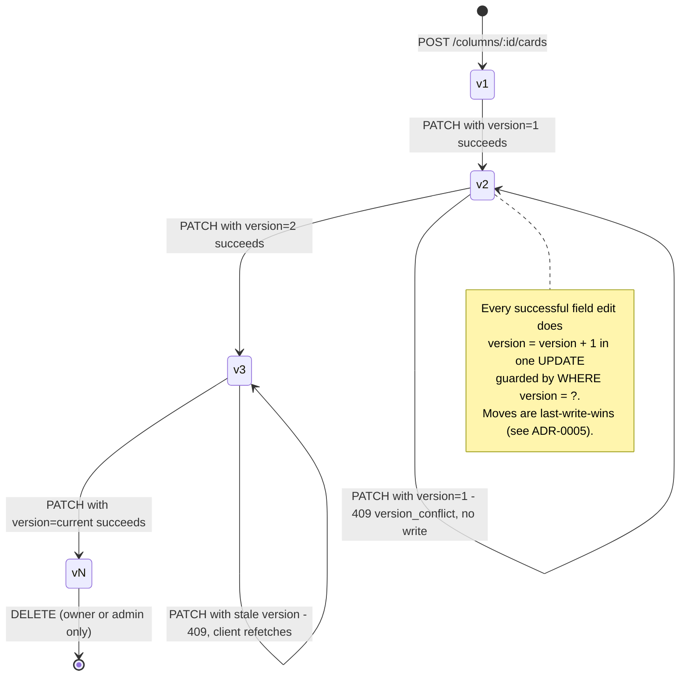

## State machine: client realtime connection

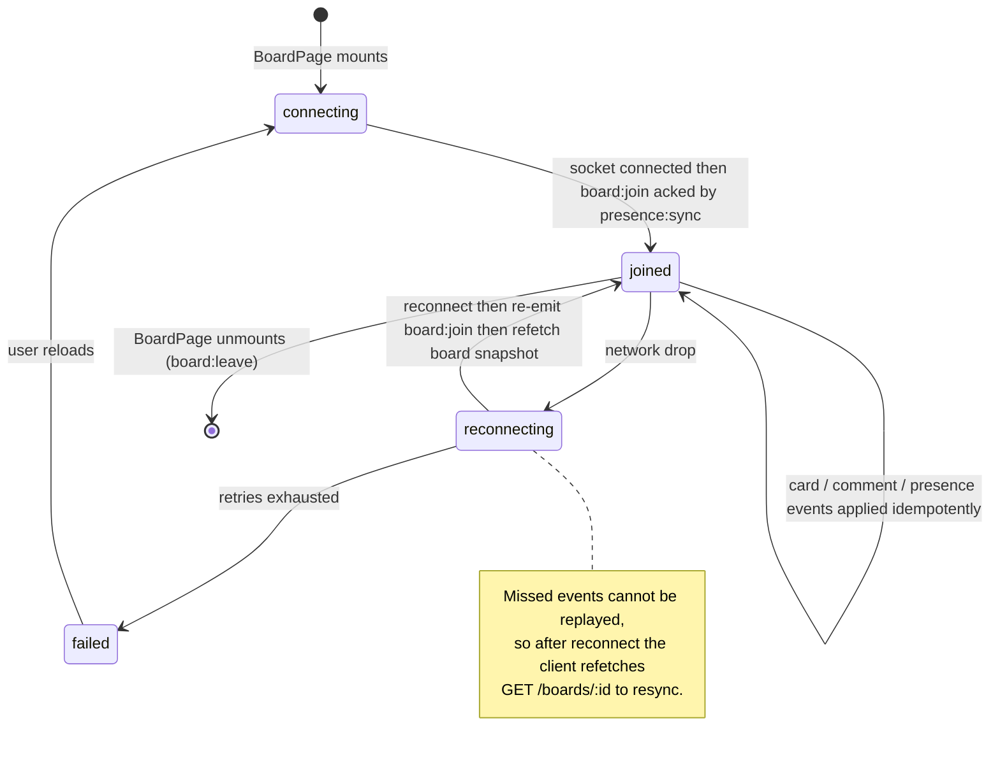

## Deployment

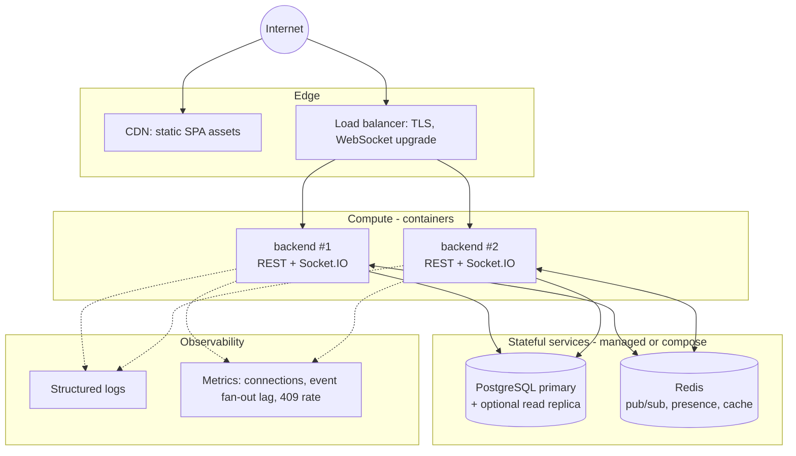
